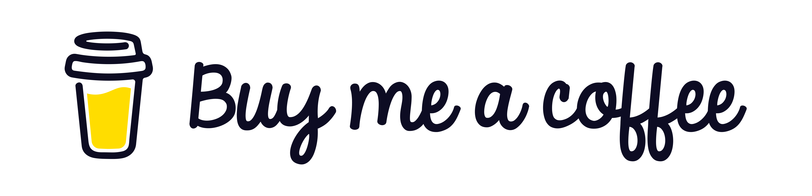

# Drum Kit 🥁

&nbsp;&nbsp;Welcome to the **Drum Kit** project! This interactive web application allows users to play a virtual drum kit using their mouse or keyboard. It's a fun and engaging way to create music and explore rhythm.

- [Drum Kit 🥁](#drum-kit-)
  - [Interface](#interface)
  - [Features](#features)
  - [Getting Started](#getting-started)
  - [Usage](#usage)
  - [Support My Work ☕](#support-my-work-)
  - [Contact Me](#contact-me)

## Interface

&nbsp;&nbsp;The interface is designed to be user-friendly and visually appealing.

## Features

- Play drums clicking on the images or using keyboard keys: W, A, S, D, J, K, L.
- Responsive design for various screen sizes.
- Easy to extend with additional sounds and features.
- Clean user interface.

## Getting Started

&nbsp;&nbsp;To get started with the Drum Kit, follow these steps:

1. **Clone the Repository**:

   ```bash
   git clone https://github.com/PrimeSolar/drum-kit.git
   ```

2. **Open the Application**: navigate to the cloned directory and open the `index.html` file in your web browser.

3. **Explore the Features**.

## Usage

&nbsp;&nbsp;Press the keys W, A, S, D, J, K, L on your keyboard or click on the images to play different drum sounds. Happy drumming! 🥁

## Support My Work ☕

&nbsp;&nbsp;If you enjoy my project and would like to support my work, consider buying me a coffee! Your contributions help me stay energized and motivated to create even more amazing content.

&nbsp;&nbsp;Every cup of coffee you buy not only fuels my passion but also allows me to dedicate more time to developing innovative projects and sharing knowledge. Whether it's a small gesture or a generous contribution, every bit is greatly appreciated!

**Click the image to support my work:**

<a href="https://coff.ee/cocacola" rel="noopener noreferrer">
  
</a>

&nbsp;&nbsp;Thank you for your support! Together, we can create something wonderful! 💖

**Copyright Notice**

Copyright © Vladislav Kazantsev
All rights reserved.
This repository contains the intellectual property of Vladislav Kazantsev, including the code and related files.
You are welcome to clone this repository and use the code for exploratory purposes.
However, unauthorized reproduction, modification, or redistribution of this code (including cloning of this repository or altering it for activities beyond exploratory use) is strictly prohibited.
Code snippets may be shared only when the original author is explicitly credited and a direct link to the original source of the code is provided alongside the code snippet.
Sharing links to the repository or its files is permitted, except when directed toward retrieval purposes.
Any form of interaction with this repository or its files is strictly prohibited when facilitated by the code, except when such interaction is for discussion or exchange purposes with others.
This copyright notice applies globally.
Email address for inquiries about collaboration, usage outside exploratory purposes, or permissions: [hypervisor7@pm.me](mailto:hypervisor7@pm.me)

<a name="contact-me"></a>

## Contact Me

&nbsp;&nbsp;LinkedIn [@PepsiCo](https://www.linkedin.com/in/PepsiCo/)


